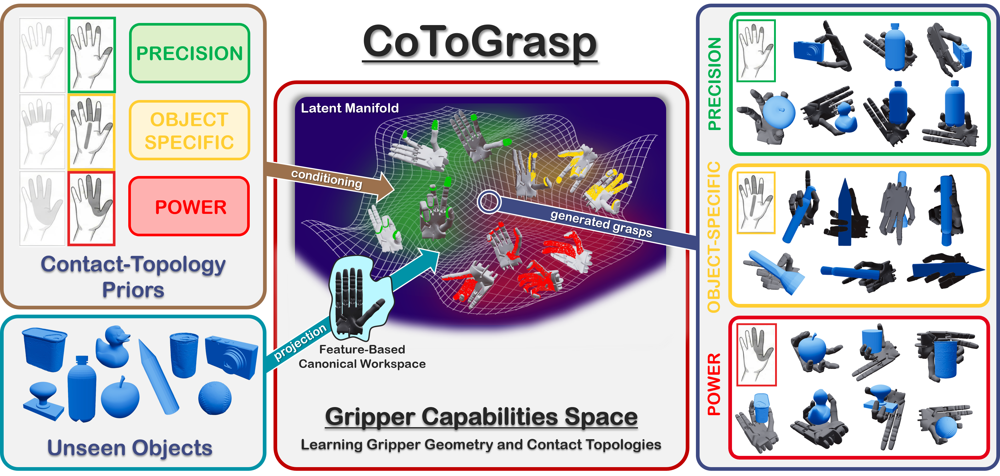

# **CoToGrasp: Contact-Topology-Conditioned Dexterous Grasp Synthesis via Canonical Workspace Learning** 

<div align="center">

#### [Julien Mérand](https://julienmerand.github.io/portfolio/)<sup>1</sup>, &nbsp;&nbsp; [Boris Meden](https://scholar.google.com/citations?user=knXPf8oAAAAJ&hl=fr)<sup>1</sup>, &nbsp;&nbsp; [Liming Chen](https://scholar.google.com/citations?user=VOPW5YYAAAAJ&hl=fr)<sup>2</sup>, &nbsp;&nbsp; [Mathieu Grossard](mailto:mathieu.grossard@cea.fr)<sup>1</sup>

#### <sup>1</sup>Université Paris-Saclay, CEA-List &nbsp;&nbsp; <sup>2</sup>École Centrale de Lyon, CNRS, LIRIS, UMR5205, Institut Universitaire de France (IUF)
#### 19th European Conference on Computer Vision (ECCV 2026)

### [**Project Page**](https://cea-list.github.io/cotograspweb/) &nbsp;&nbsp;|&nbsp;&nbsp; [**arXiv**](https://arxiv.org/abs/2608.19776) &nbsp;&nbsp;|&nbsp;&nbsp; [**BibTeX**](#-citation--contact)
</div>

<div align="center">
  
</div>

**CoToGrasp** is a novel generative framework that synthesizes diverse and stable grasps strictly conditioned on specific contact topologies.


## ⚙️ Installation

Due to the conflicting Python version requirements of CoToGrasp and Isaac Gym, it is **highly recommended** to set up two separate Conda environments: one for generation, and one for simulation.

### Training and Grasp Synthesis
Use this environment for training the models and generating grasps.

- **Requirements:** Python 3.12, PyTorch 2.4.1
- **Setup:**
    ```bash
    # Create the environment
    conda create -n cotograsp python=3.12
    conda activate cotograsp

    # Install PyTorch with CUDA 12.1 (adjust if necessary)
    pip install torch==2.4.1+cu121 torchvision==0.19.1+cu121 torchaudio==2.4.1 --index-url https://download.pytorch.org/whl/cu121

    # Standard requirements
    pip install -r cotograsp_requirements.txt

    # xFormers (https://github.com/facebookresearch/xformers):
    pip install -v --no-build-isolation -U git+https://github.com/facebookresearch/xformers.git@v0.0.28#egg=xformers
    ```

### (Optional) Evaluation with Isaac Gym - Python 3.8
If you plan to physically validate the synthesized grasps in simulation, you must use Python 3.8 to support [Isaac Gym](https://developer.nvidia.com/isaac-gym-preview-4).  

- **Requirements:** Python 3.8, PyTorch 2.4.1
- **Setup:**
    ```bash
    # Create the environment
    conda create -n cotograsp_isaac python=3.8
    conda activate cotograsp_isaac

    # Install PyTorch with CUDA 12.1 (adjust if necessary)
    pip install torch==2.4.1+cu121 torchvision==0.19.1+cu121 torchaudio==2.4.1 --index-url https://download.pytorch.org/whl/cu121

    # Standard requirements
    pip install -r isaac_validation/isaac_requirements.txt
    ```

- **Install [Isaac Gym](https://developer.nvidia.com/isaac-gym-preview-4):**
    ```bash
    tar -xvf IsaacGym_Preview_4_Package.tar.gz
    cd isaacgym/python
    pip install -e .
    ```

## 📂 Setup and Data

### 1. Download Data and Models
- **Datasets & Objects:** Download the file [COTOGRASP_DATA](https://github.com/CEA-LIST/CoToGrasp/releases/tag/v1.0) containing all robots data and objects.
- **Model Checkpoints:** Download the pre-trained [weights](https://github.com/CEA-LIST/CoToGrasp/releases/tag/v1.0) for the Shadow Hand and Allegro Hand.

### 2. Organize Directories

Extract the files `ckpt_allegro.zip`, `ckpt_shadowhand.zip` and `COTOGRASP_DATA.zip`. Your directory tree should strictly follow this structure:
```bash
# Model Checkpoints
COTOGRASP                                           # Main folder
├── ...
├── logs                                            # ckpts folder
    ├── allegro_right_goag_dgcnn_types_2_0209
    └── shadowhand_goag_dgcnn_types_2_0128
└── ...

# Dataset Directory
COTOGRASP_DATA
├── handprints
├── pointclouds
    ├── dexgraspnet
    ├── multidex
        ├── contactdb
        └── ycb
├── urdf
    ├── objects
        ├── dexgraspnet
        ├── multidex
    └── robot
└── workspaces
```

### 3. Tell CoToGrasp Where Your Data Is

Choose one of the following methods to link the code to your data:

**Option A: Export Environment Variables**  
```bash
export PYTHON_HOME_PATH='path/to/parent/of/COTOGRASP'
export PYTHON_DATA_PATH='path/to/parent/of/COTOGRASP_DATA/'
```

**Option B: Hardcode in `constants.py`**  
Directly edit the `ROOT_PATH` and `DATA_PATH` variables within the file `utils\constants.py`.


## 🚀 Usage Guide

### 1. Training a New Model
To train the model from scratch on a specific robot:

```python train.py --robot_name='shadowhand' --train_name='my_custom_training_run'```

💡 **Note:** To resume training from a checkpoint, simply append the `--resume` flag.


### 2. Grasp Synthesis (Inference)

Once trained, you can synthesize grasps for unseen objects.

```bash
python validate_models.py \
    --robot_name='shadowhand' \
    --dataset='dexgraspnet' \
    --grasp_type='m1' \
    --num_samples_per_type=20
```
- `--grasp_type='m1'`: Specifies the contact topology. Remove this flag to synthesize across all available topologies.
- `--object_name='my_object`: Specify the name of an object to synthetize grasps on. If not set, it synthesizes across the entire dataset.


**Scaling Up (Multi-GPU):** \
For large datasets, split the workload using `validate_models_multi_gpu.py` by defining the total number of chunks (`--num_sets`) and the current chunk ID (`--set_id`):
```bash
python validate_models_multi_gpu.py \
    --robot_name='shadowhand' \
    --dataset='dexgraspnet' \
    --num_samples_per_type=200 \
    --labels_check \
    --fc_check \
    --num_sets=4 \
    --set_id=0
```
- `--labels_check` & `--fc_check`: These run Label-Consistency checks and Force-Closure estimations.


### 3. Validation in Isaac Gym

To test the physical stability of your generated grasps in a physics engine:

```bash
# Make sure to activate your Isaac Gym environment first!
conda activate cotograsp_isaac

python isaac_validation/validate_isaac.py \
    --robot_name='shadowhand' \
    --dataset='dexgraspnet'
```

This will evaluate the latest inference. To evaluate a specific past run, append `--file_name='name_of_your_file'`


## 🛠️ Applying CoToGrasp to a New Gripper

To add your own robotic hand:
1. **Import Assets:** Place your robot's URDF and Mesh files into `COTOGRASP_DATA/urdf/robot/`
3. **Update Metadata:** Register the paths to your new files inside `COTOGRASP_DATA/urdf/robot/urdf_assets_meta.json`.
4. **Generate the Data:** Run `data_generation.py`. This script mathematically explores the kinematics of your new gripper to generate its specific **handprints** and **canonical workspace**.


## 📚 Citation & Contact

If you find this work helpful for your research, please consider citing us:

```
@inproceedings{merand2026cotograsp,
  title={CoToGrasp: Contact-Topology-Conditioned Dexterous Grasp Synthesis via Canonical Workspace Learning},
  author={Mérand, Julien and Meden, Boris and Chen, Liming and Grossard, Mathieu},
  journal={19th European Conference on Computer Vision (ECCV)},
  year={2026},
  url={https://cea-list.github.io/cotograspweb/},
}
```

**Questions or Issues?** Feel free to open an issue on GitHub or reach out directly to **Julien Mérand** at [julien.merand@cea.fr](mailto:julien.merand@cea.fr).


